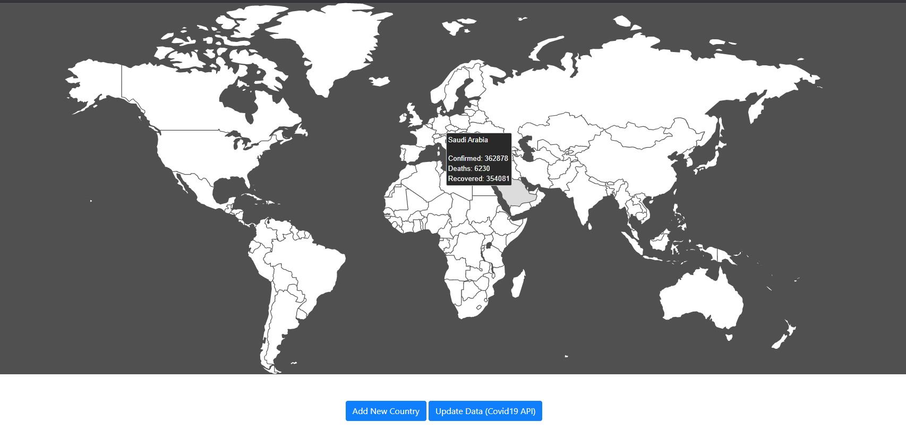

# Covid19 World Map

A sample project of using Laravel and Vue.js and grab data from <https://api.covid19api.com/summary>


## Screenshot


## Requirements
* PHP 8
* Composer 2.0.8
* Laravel 8.20.1
* npm 6.14.9


## Installation

* Clone this repository...

```bash
https://github.com/AbdullahAlajmi/laravel-vue-covid19.git
```

* Install composer dependencies
```bash
composer install
```

* Database migration (Create database table) &nbsp; (IMPORTANT: sqlite extension must be uncomment in php.ini)
```bash
php artisan migrate
```

* Install npm packages (ignore the warning for fsevents package as it's an optional)
``` bash
npm install --no-optional
```

* Compile Assets (Mix)
```bash
npm run dev
```

* Run the server
```bash
php artisan serve
```


## Usage

* for the first time the database will be empty, click on "Update Data (Covid19 API)" button to fill up the data from a public API.
* update countries data
* some countries are missing, for example Greenland (GL). Try to add a new country data using the country code (ISO alpha-2)


## License

&nbsp; &nbsp; [MIT](http://opensource.org/licenses/MIT) &nbsp;&nbsp;&nbsp;&nbsp;&nbsp; :)

